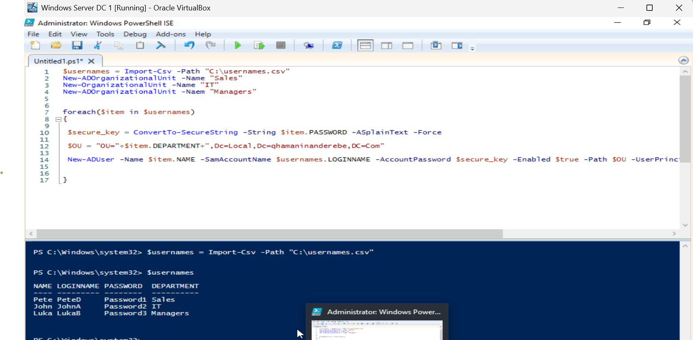

# AD-CSV-User-OU-Creation
Bulk creation of Active Directory users and OUs via PowerShell using data imported from a CSV file.

# 📄 AD User & OU Creation via CSV Import

This project showcases how to **bulk-create Organizational Units (OUs)** and **Active Directory users** using PowerShell by importing values from a CSV file.

---
📸 Screenshot

### 🖼️ Screenshots

| Step | Description               | Screenshot |
|------|---------------------------|------------|
| 1️⃣   | CSV File Preview          |  |
| 2️⃣   | PowerShell Script         |  |
| 3️⃣   | AD User Creation Output   |  |


---

## 📌 What This Script Does

- Reads user data from a CSV file.
- Automatically creates Organizational Units (Sales, IT, Managers).
- Loops through the user list and:
  - Converts plaintext password to a secure string.
  - Sets OU path dynamically using the `Department` field.
  - Creates the AD user with login name, password, UPN, and department.

---

## 🧪 Sample CSV Format

```csv
NAME,LOGINNAME,PASSWORD,DEPARTMENT
Pete,PeteD,Password1,Sales
John,JohnA,Password2,IT
Luka,LukaB,Password3,Managers

💻 PowerShell Script Overview
powershell
Copy
Edit
$usernames = Import-Csv -Path "C:\usernames.csv"

# Create OUs
New-ADOrganizationalUnit -Name "Sales"
New-ADOrganizationalUnit -Name "IT"
New-ADOrganizationalUnit -Name "Managers"  # Correct typo in -Naem

foreach($item in $usernames) {
    $secure_key = ConvertTo-SecureString -String $item.PASSWORD -AsPlainText -Force
    $OU = "OU=" + $item.DEPARTMENT + ",DC=Local,DC=qhamaninanderebe,DC=Com"

    New-ADUser -Name $item.NAME `
               -SamAccountName $item.LOGINNAME `
               -UserPrincipalName "$($item.LOGINNAME)@local.qhamaninanderebe.com" `
               -AccountPassword $secure_key `
               -Enabled $true `
               -Path $OU


✅ Prerequisites
RSAT (Remote Server Administration Tools) installed.

PowerShell running as Administrator.

AD PowerShell module available.

Domain-joined environment.


